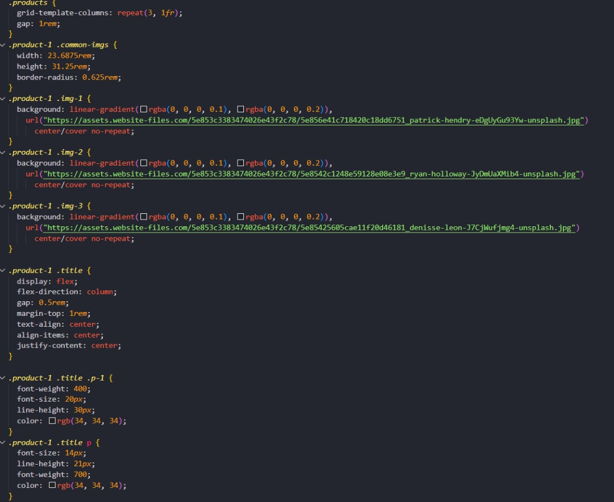

# E-commerce Website
Welcome to our E-commerce project This website is designed to offer a seamless online shopping experience, featuring various sections such as Home, Contact, About, Shop, Announcements, and Donations. Our aim is to create an intuitive and user-friendly platform for customers to browse and purchase products effortlessly.
## Project Overview 


This project is developed by Group 2 of Group E, consisting of the following members:

- `Hanad Mohamed Dahir` - Coordinating the project and managing the team.
```bash

1. Abdirahman Mohamud  Ahmed

2. Bashiir Daahir cabdullaahi

3. Nafisa Mohamed Abdi
```
Our mentor for this project is - `Hanad Mohamed Dahir` -.

## Website Sections

- Home: The landing page that provides an overview of our website and its features.
- Contact: A page where users can reach out to us for any inquiries or support.
- About: Information about our team and the mission of our project.
- Shop: The main section where users can browse and purchase a variety of products. It includes subpages for product details and prices.
- Announcements: Updates and news related to our website and products.
- Donations: A page where users can contribute to support our project and its initiatives. It includes subpages providing additional information on how donations are used.

## Features

- Browse products by category 

- View product details and prices

- Make donations with detailed information

- Contact form for inquiries

- Regular announcements and updates


## ScreenShot



## FAQ

#### Question 1: How can I browse products on the website?

A:  Visit the "Shop" section to explore our range of products categorized for easy browsing.

#### Question 1: How can I contact customer support?
A: Use the "Contact" section to reach out to us with any questions or issues you have.

## Color Reference

| Color             | Hex                                                                |
| ----------------- | ------------------------------------------------------------------ |
| Primary    Color |  #222222 |
| Secondary  Color |  #333333 |
| Background Color |  #eb5757 |
| Text       Color |  #222222 |


## Acknowledgements


We would like to express our gratitude to the following individuals and organizations for their support and contributions to this project:

### Team Members
- Abdirahman Mohamud: For leading the group and ensuring all aspects of the project are on track. work on shop page and Donate.
- Bashiir Daahir: For his work on Home and about pages development, implementing .
- Nafisa Mohamed: For her efforts in project Announcement and contact.

## Mentors and Advisors
- `Hanad Mohamed Dahir` : For providing guidance, feedback, and encouragement throughout the project.

## Tools and Resources
*WhatFont*: For helping us identify and select fonts that enhance the visual appeal of our website.
*ColorZilla*: For enabling precise color selection and ensuring a consistent color scheme across our website.

## Special Thanks 
*Vercel App Hosting Services*: For providing hosting solutions that helped us test and deploy our website.
*All Mentors*: For their invaluable guidance and support throughout the project.


## Tech Used

**Frontend:** HTML, CSS, JavaScript
## Deployment

To deploy this project run

```bash

https://e-commerce-swart-ten.vercel.app
```

